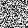

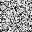
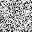


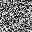


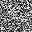
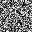

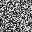

# 🎨 painter-ga

[](./)
[](./)

[](https://github.com/MartinKondor/painter-ga/)
[](https://github.com/MartinKondor/painter-ga)
[](https://github.com/MartinKondor/painter-ga/issues)

[](https://opensource.org/licenses/MIT)

Painter genetic algorithm.

## Getting Started

### Prerequisites

* Python 3.8.6+
* Anaconda 4.9.2+ (optional)
* Python modules from the `requirements.txt`

### Usage

To run the genetic algorithm, use the command:

```$ python .```

The generated images can be fund in the ```paintings``` directory.

To finetune the algorithm you can modify the parameters in the ```__main__.py``` file.

## Contributing

This project is open for any kind of contribution from anyone.

### Steps

1. Fork this repository
2. Create a new branch (optional)
3. Clone it
4. Make your changes
5. Upload them
6. Make a pull request here

## Examples

These test were taken with these parameters:
```python
POP_SIZE = 100  # Number of starting images
PERSON_SIZE = (32, 32,)  # Size of images
```

The ```EPOCH``` parameter varies row by row.

| No. of evolution steps  |  Best (brightest) painting |  Worst (darkest) painting | Time to finish
|---|---|---|---|
| 16 |  |   | 00:03 |
| 32 |   |  | 00:06 |
| 64 |   |  | 00:12 |
| 128 |   |  | 00:24 |
| 256 |   |  | 00:48 |
| 512 |   |  | 01:37 |
| 1024 |   |  | 03:18 |

_On average 5.25 it/s._

Their improval with each step:

<p align="center">
    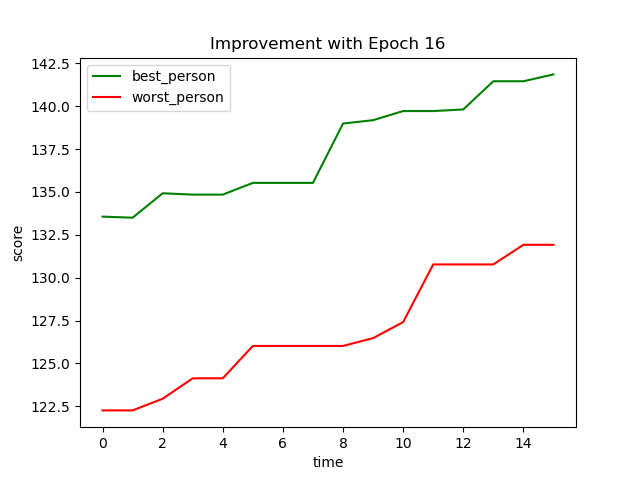
    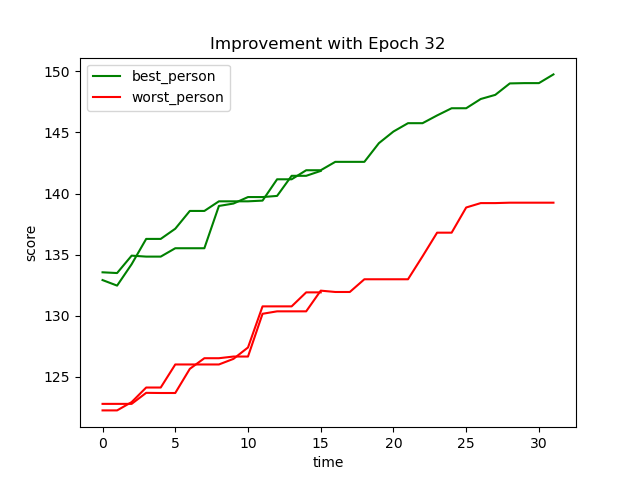
    
    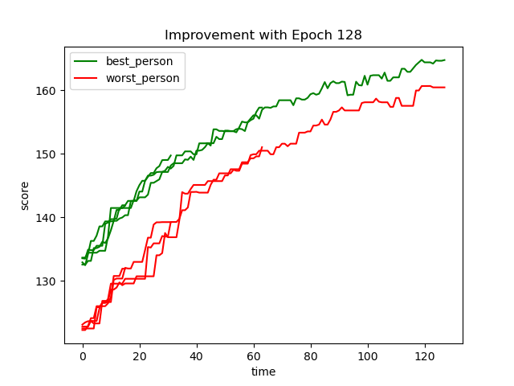
    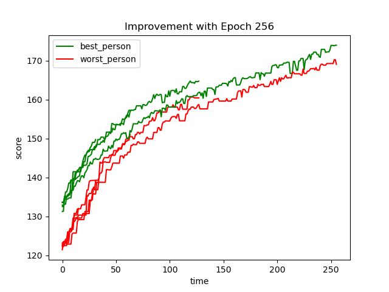
    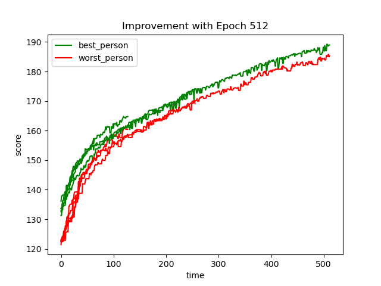
    
</p>

## Authors

* **[Martin Kondor](https://github.com/MartinKondor)**

<p align="center">
<a title="Fiverr" href="https://www.fiverr.com/martinkondor">

</a>
</p>

# License

Copyright &copy; 2022 Martin Kondor.

See the [LICENSE](LICENSE) file for details.
